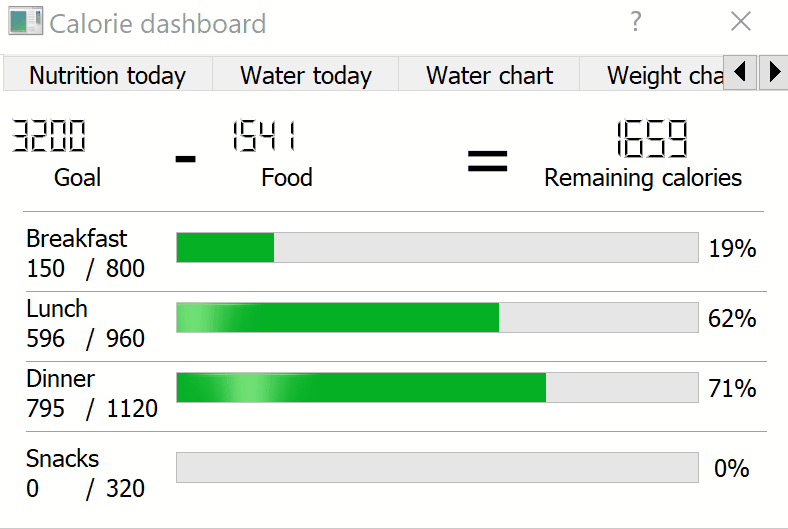

# MyFitnessPal Calorie Tracker Dashboard

Counting calories can be an effort, but it’s much easier to always stay on track if you have a way to visualize your tracking through a dashboard. This library let’s you do just this directly connected to a Raspberry Pi and a DSI Screen which you can easily hang in your kitchen.
The project was simply created during a week for my own benefit but can also be extended to whatever you want. MyFitnessPal (MFP) only has a private API which creates an unnecessary barrier between you and your data. This library is built on top of the library from coddingtonbear (https://github.com/coddingtonbear/python-myfitnesspal) which bypasses this barrier.




## Requirements

Disclaimer: At first, this project was just intended for my own use. Therefore, I didn’t create a new environment to work on this project so that I could easily generate a requirements-file which only had the requirements needed to run this application (I know, bad practice!). In short, I’m unable to package this properly. The current environment I worked on during the project, is commonly used for my Deep Learning GPU intensive work. Therefore, a lot of the requirements that are listed in the requirements.txt-file; are not used in the project. But I will still add the file to the repo. The reason being that when you initially get an error saying that “a library is missing”; you can check the requirements-file and download the specific version that I am using (saving you time). But pay attention that 90% of the packages listed, were NOT used during this project.

If you want to replicate my Anaconda environment, simply use the req.txt file like this:

```
$ conda create --name <env> --file <this file>
```

If you want the usual requirements-file, use the requirements.txt file.
Key requirements that I can tell you (from what I remember) were used in this project, were:

* PyQt5_gpl-5.10
* sip-4.19.7
* keyring==8.7
* keyrings.alt==1.3
* lxml==4.1.0
* matplotlib==2.1.0
* myfitnesspal==1.10
* numpy==1.12.1
* pandas==0.20.3
* QtPy==1.3.1
* six==1.11.0
* xlrd==1.1.0
* blessed==1.14.2
* measurement==2.0.1
* python-dateutil==2.6.1
* requests==2.18.4

A lot of effort had to be put in, to make PyQT5 work together with MyFitnessPal on the Raspberry Pi 3 running Raspbian. Not only was the distro missing a lot of packages that didn’t work on the specific version, but a lot of the packages required specific versions as well in order to work properly. Therefore, the versions in the requirements.txt file are guaranteed to work on the date of publishing this repo.

## Authentication

You need to edit the following code in the main .py file to provide your credentials to the keyring:

```
myfitnesspal.keyring_utils.store_password_in_keyring("USERNAME", "PASSWORD")
localclient = myfitnesspal.Client("USERNAME")
```

You also need to edit a “getpass.py” file for the app not to request input at each and every startup. 
The file is usually located in the same folder where your environment is located.

For me, this was:

```
C:\Users\angill\AppData\Local\Continuum\anaconda3\envs\deeplearning\Lib\
```

If you e.g. are using a WinPython environment, then your path would look something like:

```
C:\Users\angill\Downloads\WinPython-64bit-3.6.3.0Qt5\python-3.6.3.amd64\Lib
```

Simply open up the “getpass.py” file in an editor like Visual Studio Code, and replace all:

```
passwd = _raw_input(prompt, stream, input=input)
```

with your password as the input for the passwd variable, e.g.:

```
passwd = “PASSWORD”
```

## Installing packages

In order to install packages as root, simply add “sudo” in front of the installation. E.g.:

```
sudo pip install <package-name>
```
If you want to install packages by providing the full path to the file, write these commands:

```
1.  wget https://www.python.org/ftp/python/3.5.2/Python-3.5.2.tar.xz

2.  tar -xvf Python-3.5.2.tar.xz

3.  cd Python-3.5.2

4.  ./configure

5.  make

6.  make altinstall
```

The steps mentioned above had to be performed in the right order on the RPI running Raspbian. 
Both packages are working versions of the tools:

```
1.  sip-4.19.7.tar.gz

2.  PyQt5_gpl-5.10.tar.gz
```

Both packages are provided in this repo so that you can simply install these on your RPI.

## Connecting to the RPI

There is no reason to use SCP when sending files to the Raspberry Pi.
Simply download FileZilla and transfer files to the RPI through SFTP when the RPI is on the same network.

Use SSH when connecting to the Pi to use terminal commands. I use PUTTY in order to do this. The standard Raspbian username is “pi” and password is “raspbian”. When you have connected to the RPI through SSH, you can write your commands for installation and so on. If your password doesn’t work, give your pi a new password through the settings on the pi itself, and then retry typing your new password.

## Worth mentioning

The package named “lxml” takes a lot of time to install on the RPI. Therefore, to make sure the installation is running after you wrote the correct installation command through the terminal, open a new session and type “top” to see if the system is busy building the lxml package.

```
PID USER PR NI VIRT RES SHR S %CPU %MEM TIME+ COMMAND
1645 root 20 0 322224 305740 5384 R 100.0 29.8 3:27.47 /usr/lib/gcc/arm-linux-gnueabihf/5/cc1 -quiet -I /usr/include/libxml2 -I src/lxml/includes -I /usr/include/python2.7 -imultiarch arm-linux-gnueabihf -D_REENTRANT -D ...
```

## Changing meal routine

Change the following variable, since no fast-change is configured

```
# Current routine selection
# 0 = shred, 1 = lean, 2 = bulk
mealGoals = 1 #Currently set to lean-mode
```

and change the respective variables so that you consume the right amount of calories 

## Ending note

If everything above has been conducted, the last step is to run the .py file in this repo that contains the main code connected to the MyFitnessPal backend. 

## Lacking functions

Yes, the code is dirty. Therefore, a lot of shortcuts has been made in order to get to the goal as fast as possible. Feel free to make a better version. I currently don’t have the time to make the coder better at this moment.
* Crashing kernel when exiting
* Restart and Exit button fix
    * Currently the restart app just points to the same file
    ```
    def restart_click(self):
    Application.close()
    subprocess.call("%Run calorietracker.py", shell=True)
    or
    subprocess.call("Python calorietracker.py", shell=True)
    ```
* Everything in one file, no import of self written code
* A button in the app to overwrite routine selection (shred/clean/bulk)
* No refresh mechanism configured (I simply re-open the app by clicking the green “play”-button from thonny IDE on the RPI, and it re-launches).
